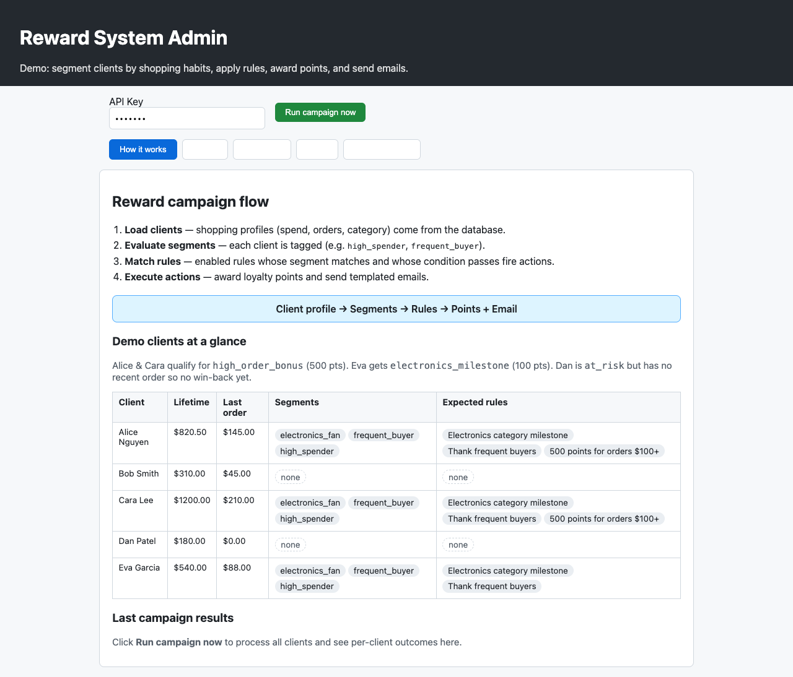
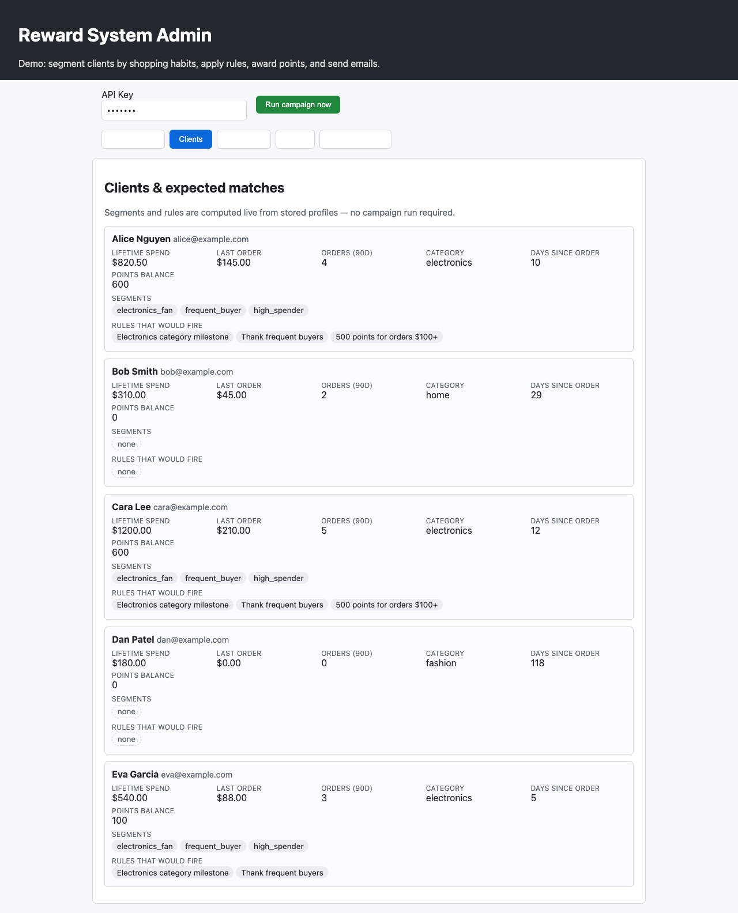
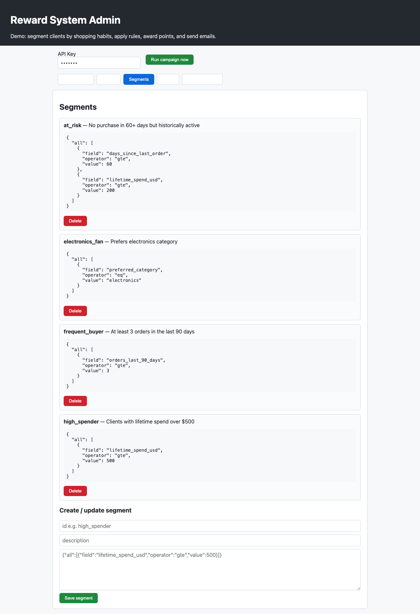
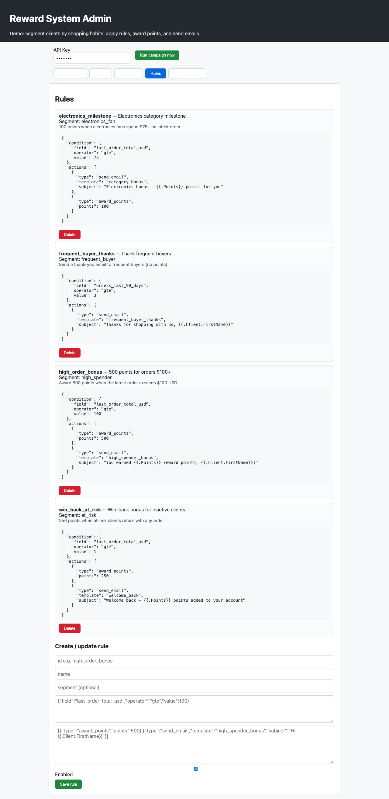
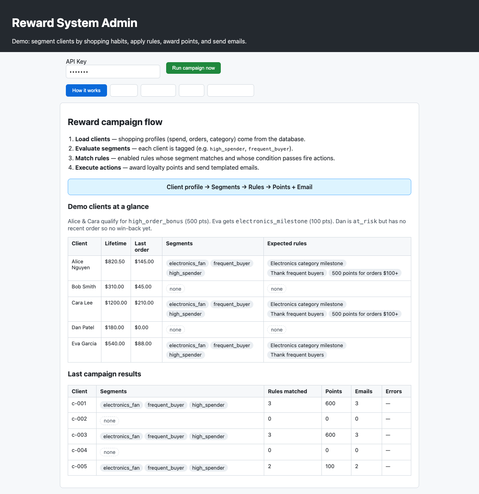
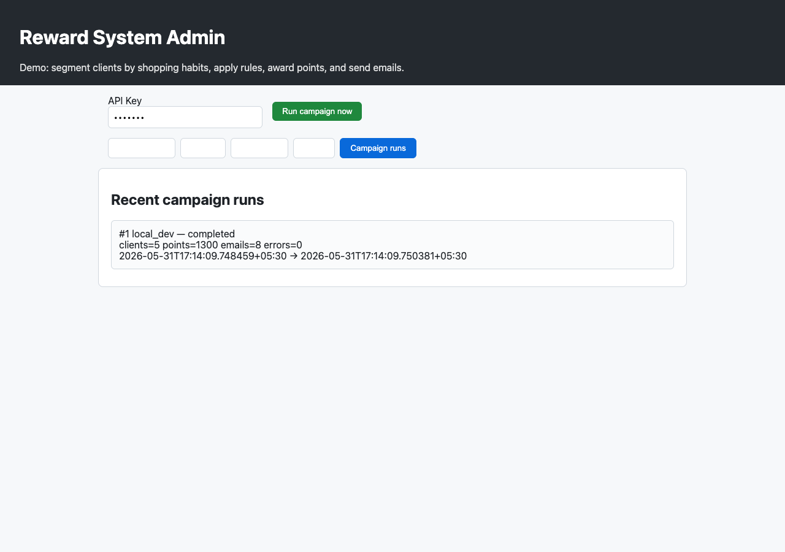

# reward-system-users

Production-ready Go service for **segment-based email campaigns** and **rule-driven loyalty rewards**.

## Features

- **PostgreSQL / MySQL** — clients, profiles, segments, rules, ledger, campaign history
- **HTTP API** — REST endpoints for CRUD + manual campaign runs
- **Admin UI** — edit segments/rules at `/admin` (no YAML editing)
- **Cron scheduler** — daily campaign runs (`cron.enabled`)
- **Pluggable rewards** — `db_ledger`, in-memory `ledger`, **Open Loyalty**, **Voucherify**
- **Docker + CI** — `docker compose up`, GitHub Actions

## Admin UI

Start the server (`make serve-dev` or `docker compose up`), then open **http://localhost:8080/admin/** (trailing slash required). Use API key `dev-key` unless you changed `server.admin_api_key`.

The UI walks through the full reward flow: load client shopping profiles → evaluate segments → match rules → award points and send emails.

### How it works

Overview of the campaign pipeline and demo client summary:



### Clients

Live segment and rule matching per client (no campaign run required):



### Segments

View and edit segment definitions (JSON match conditions):



### Rules

View and edit campaign rules (conditions + point/email actions):



### Campaign run

Click **Run campaign now** to process all clients. Results appear on the overview tab and in run history:





To regenerate screenshots locally:

```bash
make serve-dev   # in another terminal
npm install --no-save puppeteer-core
node scripts/capture-admin-screenshots.mjs
```

## Quick start (Docker — recommended)

```bash
git clone https://github.com/durgakar/reward-system-users.git
cd reward-system-users
docker compose up --build
```

- App: http://localhost:8080
- Admin UI: http://localhost:8080/admin
- Mailhog: http://localhost:8025
- API key (default): `dev-key` — set header `Authorization: Bearer dev-key`

See [Admin UI](#admin-ui) for screenshots of each screen.

## Local development (Go)

Requires **Go 1.25+**

```bash
brew install go
go mod tidy

# File/CSV mode (no database):
make dry-run

# In-memory dev mode (no Docker/PostgreSQL):
make serve-dev
# Admin UI: http://127.0.0.1:8080/admin/

# PostgreSQL mode:
docker compose up -d postgres mailhog
make migrate
make serve
```

### Commands

| Command | Description |
|---------|-------------|
| `reward-system-users serve` | HTTP API + admin UI + cron |
| `reward-system-users migrate` | Apply DB schema + seed data |
| `reward-system-users run` | One-shot campaign (CLI) |

## Architecture

```
PostgreSQL ──► ShoppingSource ──► SegmentProvider ──► RuleEngine ──► Actions
   ▲              (database)        (database)         (database)    ├─ db_ledger / Open Loyalty / Voucherify
   │                                                                    └─ SMTP / stdout
 Admin UI / REST API
```

## API (v1)

All `/api/v1/*` routes require `Authorization: Bearer <admin_api_key>`.

| Method | Path | Description |
|--------|------|-------------|
| GET | `/health` | Liveness |
| GET | `/ready` | DB connectivity |
| GET | `/api/v1/clients` | List clients |
| GET/PUT/DELETE | `/api/v1/segments/{id}` | Manage segments |
| GET/PUT/DELETE | `/api/v1/rules/{id}` | Manage rules |
| POST | `/api/v1/campaigns/run` | Run campaign now |
| GET | `/api/v1/campaigns/runs` | Campaign history |

## Voucherify integration

The project includes a live **Voucherify** loyalty provider. To connect:

### 1. Get credentials from Voucherify

1. Sign up at [voucherify.io](https://www.voucherify.io/)
2. **Project Settings → Application Keys** — copy **Application ID** and **Secret Key**
3. **Loyalty → your campaign** — copy **Campaign ID** (starts with `camp_`)

### 2. Configure

```yaml
reward_provider: voucherify

voucherify:
  base_url: https://api.voucherify.io/v1
  application_id: YOUR_APP_ID
  secret_key: YOUR_SECRET_KEY
  loyalty_id: camp_XXXXXXXXX
```

Or via environment:

```bash
export REWARD_PROVIDER=voucherify
export VOUCHERIFY_APP_ID=your_app_id
export VOUCHERIFY_SECRET_KEY=your_secret_key
export VOUCHERIFY_LOYALTY_ID=camp_XXXXXXXXX
```

### 3. Test the connection

```bash
go run ./cmd/reward-system-users voucherify-test -config config/config.yaml
```

### 4. Run a campaign

When rules award points, the provider will:
1. Enroll the client as a loyalty member (if new)
2. Add points via `POST /loyalties/{campaignId}/members/{clientId}/balance`

Client IDs from your database map to Voucherify `customer.source_id`.

---

## Reward integrations (all providers)

Set in config or environment:

```yaml
reward_provider: db_ledger   # default — PostgreSQL ledger
# reward_provider: open_loyalty
# reward_provider: voucherify
```

Environment variables:

- `OPEN_LOYALTY_API_KEY`
- `VOUCHERIFY_APP_ID`, `VOUCHERIFY_SECRET_KEY`, `VOUCHERIFY_LOYALTY_ID`
- `DATABASE_URL`, `ADMIN_API_KEY`, `REWARD_PROVIDER`

## Production checklist

1. Set strong `server.admin_api_key`
2. Use real SMTP (SendGrid, SES, Postmark)
3. Point `reward_provider` at Open Loyalty or Voucherify
4. Deploy via Docker or Kubernetes using included `Dockerfile`
5. CI runs on every push to `main` (`.github/workflows/ci.yml`)

## Legacy file/CSV mode

For demos without a database, use `config/config.example.yaml`:

```yaml
rules_source: file
segments_source: file
shopping_source: csv
reward_provider: ledger
```

## License

MIT
